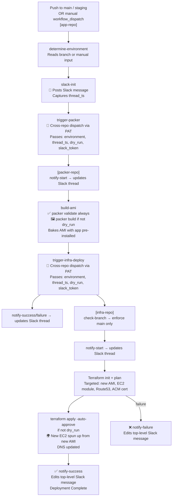

# Immutable Infrastructure Deployment Pipeline with GitHub Actions, Packer & Terraform

> **Pattern:** Multi-repo immutable deployment pipeline chained via cross-repo `workflow_dispatch` triggers, with end-to-end Slack thread tracking.

---

## Overview

This document describes how to build a production-grade immutable deployment pipeline spanning three GitHub repositories. Instead of mutating a live server on every deployment (SSH in, pull code, restart), this pattern bakes a **brand-new AWS AMI** on every release and replaces the infrastructure using Terraform. This eliminates configuration drift, makes rollbacks trivial, and ensures staging and production always run identical, reproducible environments.

The pipeline chains three repositories:

```
[app-repo]  →  [packer-repo]  →  [infra-repo]
    Triggers         Builds AMI         Applies Terraform
    via API          Triggers via API   Spins up new EC2
```

A **single Slack thread** is created at the start of the pipeline and updated across all three repositories — giving you one unified deployment log in real time, regardless of how many repos are involved.

---

## Architecture



---

## The Slack Thread Trick

The most elegant part of this pattern is **Slack thread continuity across repos**. A `thread_ts` (thread timestamp) is created once in the app-repo and passed as an input through every subsequent cross-repo dispatch. Each repo uses that same timestamp to reply to the original thread — so the entire multi-repo, multi-stage pipeline appears as one continuous Slack conversation.

```
[app-repo]      → Creates thread_ts  →  "👀 Production deployment started"
[packer-repo]   → Uses thread_ts     →  "🚀 AMI Build started"
                                     →  "✅ AMI Built successfully"
[infra-repo]    → Uses thread_ts     →  "🚀 Infra deployment started"
                                     →  "✅ Deployment Complete"  ← edits top-level message
```

---

## Dry Run Mode

Every workflow accepts a `dry_run` boolean input. When `true`:
- Packer runs `validate` only — no AMI is built
- Terraform runs `plan` only — no infrastructure changes

This lets you safely preview what would happen before committing to a full deployment. Useful for previewing Terraform changes after infrastructure modifications.

---

## AWS Authentication — OIDC (No Long-Lived Keys)

Both the packer-repo and infra-repo authenticate to AWS using **OpenID Connect (OIDC)**, not static access keys. The workflow assumes an IAM role via GitHub's identity token — no secrets to rotate, no keys to leak.

```yaml
- uses: aws-actions/configure-aws-credentials@v4
  with:
    role-to-assume: arn:aws:iam::<ACCOUNT_ID>:role/GithubOICD
    aws-region: us-east-1
```

The app-repo uses a **GitHub Personal Access Token (PAT)** only for the cross-repo API call — not for AWS access.

---

## Targeted Terraform Apply

The `terraform apply` is deliberately **targeted** to only the resources that change on every deployment — the AMI data source, the EC2 module, DNS records, and the ACM certificate. This avoids accidentally touching shared infrastructure (VPCs, databases, etc.) outside the scope of an app deployment.

```bash
terraform apply -auto-approve -refresh=false \
  -target=data.aws_ami.my_app \
  -target=module.my-app-backend \
  -target=data.aws_route53_zone.selected \
  -target=aws_route53_record.api \
  -target=aws_route53_record.api_ipv6 \
  -target=aws_acm_certificate.prod_cert
```

---

## Branch Safety Guard

The infra-repo workflow includes a reusable `check-branch` workflow that enforces the infra deploy **only runs from the `main` branch** — preventing accidental infrastructure changes from feature branches.

```yaml
jobs:
  check-branch:
    uses: ./.github/workflows/check-branch.yml
    with:
      required_branch: "main"
```

---

## Cross-Repo Dispatch Pattern

The key to chaining repos is using the GitHub REST API to fire a `workflow_dispatch` event on another repository:

```yaml
- name: Trigger Downstream Repository
  uses: actions/github-script@v7
  with:
    github-token: ${{ secrets.PERSONAL_ACCESS_TOKEN }}
    script: |
      await github.rest.actions.createWorkflowDispatch({
        owner: '${{ github.repository_owner }}',
        repo: 'target-repo-name',
        workflow_id: 'target-workflow.yml',
        ref: 'main',
        inputs: {
          environment: '${{ inputs.environment }}',
          thread_ts:   '${{ inputs.thread_ts }}',
          slack_token: '${{ secrets.SLACK_BOT_TOKEN }}',
          dry_run:     '${{ inputs.dry_run }}'
        }
      });
```

> **Note:** The PAT must have `repo` and `workflow` scopes, and must belong to a user with write access to the target repository.

---

## Reusable Workflow Scripts

See [`scripts/pipeline/github-actions/`](../scripts/pipeline/github-actions/) for complete, generic, copy-paste-ready workflow templates for each of the three repositories.

---

## Design Decisions

| Decision | Rationale |
|---|---|
| **Immutable AMI over mutable SSH deploys** | Eliminates config drift; every deployment is reproducible from source |
| **Three separate repos** | Separation of concerns — app code, image building, and infrastructure are independent release cycles |
| **Cross-repo dispatch via PAT** | GitHub's OIDC doesn't support cross-repo triggers; PAT is the standard approach |
| **Slack `thread_ts` passed as input** | Enables a single unified deployment log across all repos without a shared backend |
| **`dry_run` at every stage** | Allows safe previewing at any point in the pipeline without full infrastructure changes |
| **Targeted Terraform** | Scopes the blast radius of each deployment; shared infra is never accidentally modified |
| **OIDC for AWS auth** | No static credentials to rotate or leak; tokens are ephemeral and scoped to the job |
| **Branch guard on infra-repo** | Prevents infra changes from anything other than the main branch, even if triggered cross-repo |
